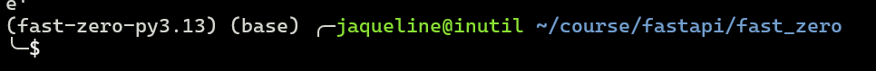
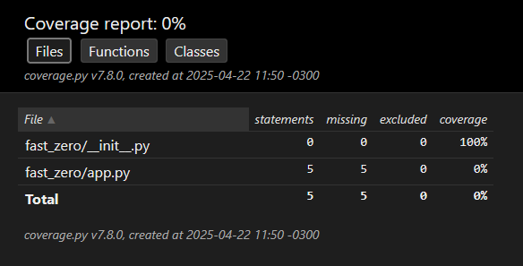

## Estudos sobre o FastAPI

Conhecendo a FastAPI. Este Repositório é um agregado de notas e código referentes aos meus estudos do FastAPI.

## Bibliografia

- Documentação Oficial: https://fastapi.tiangolo.com/
- FastAPI do Zero: https://fastapidozero.dunossauro.com/
- Repositório do livro: https://github.com/PacktPublishing/Building-Data-Science-Applications-with-FastAPI

### Instalação
Para executar este projeto, você precisará ter o Python e o Uvicorn instalados. Você pode instalar as dependências necessárias com o seguinte comando:

- Recomendável criar um ambiente virtual

```bash
pip install fastapi uvicorn
```

## Conhecimentos Básicos

#### Convenção de Nomenclatura de Funções

Por convenção, as funções em Python devem ser nomeadas usando o estilo snake case. Por exemplo, use my_function em vez de MyFunction. Essa convenção ajuda a manter a consistência e a legibilidade do código.

#### Aceitando Argumentos Dinamicamente com *args e **kwargs

No Python, você pode usar *args e **kwargs para aceitar um número variável de argumentos em suas funções.

```python
def read_items(*args, **kwargs):
    return {"args": args, "kwargs": kwargs}
```

## FastAPI do Zero


### pipx

O pipx é uma ferramenta usada para instalar e executar ferramentas Python globalmente no sistema de forma segura. Diferente do pip, que instala ferramentas sem um ambiente virtual (por padrão) e pode "sujar" nosso ambiente, o pipx cria um ambiente virtual e isola cada ferramenta dentro dele, facilitando a instalação de pacotes globais.

```bash
# Instlar o pipx
pip install --user pipx

# permitir que o sistema reconheça as ferrametnas instaladas via pipx 
pipx ensurepath
```

### Poetry

O Poetry é um gerenciador de projetos para Python. Ele pode nos ajudar em diversas etapas do ciclo de desenvolvimento, como a instalação de versões específicas do Python, a criação e manutenção de projetos (incluindo a definição de estruturas de pastas, o gerenciamento de ambientes virtuais e a instalação de bibliotecas), além de permitir a publicação de pacotes e muito mais.

```bash
# Cria um ambiente virtual isolado para poetry e o deixa disponível no sistema.
pipx install poetry 

# A função self add do Poetry instala extensões para podermos executar novos comandos com o Poetry, neste caso, o comando poetry shell, que nos permite entrar nos ambientes virtuais.
poetry self add poetry-plugin-shell

# versão especifica do python
poetry python install 3.13

```

### Criando o projeto


```bash
# Criando a pasta com a estrutura do projeto
poetry new --flat fast_zero 

cd fast_zero

# informar ao poetry qual a versão do python queremos usar
poetry env use 3.13

```

```pyproject.toml

[project]
# ...
requires-python = ">=3.13,<4.0" 


```
### Instalando o FastAPI

```bash
poetry install
poetry add 'fastapi[standard]' 

```

#### Abrindo um script interativo no python

```bash
python -i fast_zero/app.py

```
### Habilitando o ambiente virtual via poetry

```bash
poetry shell
```


### Executando projeto em desenvolvimento

```bash
fastapi dev fast_zero/app.py

```

### Uvicorn

O FastAPI é ótimo para criar APIs, mas não pode disponibilizá-las na rede sozinho. Embora o FastAPI tenha uma aplicação de terminal que facilita a execução. Para podermos acessar essas APIs por um navegador ou de outras aplicações clientes, é necessário um servidor. É aí que o Uvicorn entra em cena. Ele atua como esse servidor, disponibilizando a API do FastAPI em rede. Isso permite que a API seja acessada de outros dispositivos ou programas.

```bash
# Chamando diretamente o uvicorn
uvicorn fast_zero.app:app
```
> Esse comando diz ao uvicorn o seguinte: na pasta fast_zero existe um arquivo chamado app. Dentro desse arquivo, temos uma aplicação para ser servida com o nome de app. O comando é composto por uvicorn pasta.arquivo:variável. 

### Instalação de Ferramentas de Desenvolvimento

Serão instaladas no grupo de desenvolvimento
```bash
poetry add --group dev pytest pytest-cov taskipy ruff

```
Configurando as ferramentas de desenvolvimento

Após a instalação das ferramentas de desenvolvimento, precisamos definir as configurações de cada uma individualmente no arquivo pyproject.toml.

#### RUFF
migrações de banco de dados será ignorado na checagem e na formatação:

```pyproject.toml

[tool.ruff]
line-length = 79
extend-exclude = ['migrations']
```

#### Linter

Durante a análise estática do código, queremos buscar por coisas específicas. No Ruff, precisamos dizer exatamente o que ele deve analisar. Isso é feito por códigos. Usaremos estes:

- I (Isort): Checagem de ordenação de imports em ordem alfabética
- F (Pyflakes): Procura por alguns erros em relação a boas práticas de código
- E (Erros pycodestyle): Erros de estilo de código
- W (Avisos pycodestyle): Avisos de coisas não recomendadas no estilo de código
- PL (Pylint): Como o F, também procura por erros em relação a boas práticas de código
- PT (flake8-pytest): Checagem de boas práticas do Pytest

```pyproject.toml
[tool.ruff.lint]
preview = true
select = ['I', 'F', 'E', 'W', 'PL', 'PT']
```

#### Formatter

A formatação do Ruff praticamente não precisa ser alterada. Pois ele vai seguir as boas práticas e usar a configuração global de 79 caracteres por linha. A única alteração que farei é o uso de aspas simples ' no lugar de aspas duplas ":

```pyproject.toml
[tool.ruff.format]
preview = true
quote-style = 'single'
```
#### pytest

O Pytest é uma framework de testes, que usaremos para escrever e executar nossos testes. O configuraremos para reconhecer o caminho base para execução dos testes na raiz do projeto .:
pyproject.toml

```pyproject.toml
[tool.pytest.ini_options]
pythonpath = "."
addopts = '-p no:warnings'
```

Na segunda linha dizemos para o pytest adicionar a opção no:warnings. Para ter uma visualização mais limpa dos testes, caso alguma biblioteca exiba uma mensagem de warning, isso será suprimido pelo pytest.

#### Taskipy

A ideia do Taskipy é ser um executor de tarefas (task runner) complementar em nossa aplicação. No lugar de ter que lembrar comandos como o do fastapi, que vimos na execução da aplicação, que tal substituir ele simplesmente por task run?

```pyproject.toml
[tool.taskipy.tasks]
lint = 'ruff check'
pre_format = 'ruff check --fix'
format = 'ruff format'
run = 'fastapi dev fast_zero/app.py'
pre_test = 'task lint'
test = 'pytest -s -x --cov=fast_zero -vv'
post_test = 'coverage html'
```
Os comandos definidos fazem o seguinte:

- lint: Faz a checagem de boas práticas do código python
    pre_format: Faz algumas correções de boas práticas automaticamente
- format: Executa a formatação do código em relação as convenções de estilo de código
- run: executa o servidor de desenvolvimento do FastAPI
- pre_test: executa a camada de lint antes de executar os testes
- test: executa os testes com pytest de forma verbosa (-vv) e adiciona nosso código como base de cobertura
- post_test: gera um report de cobertura após os testes

Para executar um comando, é bem mais simples, precisando somente passar a palavra task <comando>.

Comandos com prefixo pre e pos

> Todos os comandos do taskipy que apresentam prefixos como pre_commando ou pos_commando não precisam ser executados diretamente. Por exemplo, se executarmos o comando task test ele executará o comando pre_test e caso tudo ocorra bem, sem erros, ele executará o test, caso não aconteçam erros, o pos_test será executado.

Nada impede que os comandos com prefixos sejam executados diretamente, mas eles são montados para serem executados em cadeia.

Executando e corrigindo

```bash
# Verificando os erros
task lint

# Corrigindo
task format
```
### Introdução ao Pytest: Testando o "Hello, World!"

```bash
# executando os testes
task test

# Até esse ponto, nossa aplicação não tem nenhum teste implementado, devido ao erro na execução do teste a task post_test() não é executada e o relatório não é construído. Fazemos manualmente
task post_test
```


#### Escrevendo o primeiro teste

Na pasta tests, vamos criar um arquivo chamado `test_app.py`.

> Por convenção, todos os arquivos de teste do pytest devem iniciar com um prefixo test_.py

Para testar o código feito com FastAPI, precisamos de um cliente de teste. A grande vantagem é que o FastAPI já conta com um cliente de testes no módulo `fastapi.testclient` com o objeto `TestClient`, que precisa receber nosso app como parâmetro:

Para analisar todas as etapas de um teste, usaremos como exemplo este primeiro teste que escrevemos:


```python
# tests/test_app.py
from http import HTTPStatus

from fastapi.testclient import TestClient

from fast_zero.app import app


def test_root_deve_retornar_ok_e_ola_mundo():
    client = TestClient(app)  # Arrange

    response = client.get('/')  # Act

    assert response.status_code == HTTPStatus.OK  # Assert
    assert response.json() == {'message': 'Olá Mundo!'}  # Assert
```

Com base nesse código, podemos observar as três fases:

- Fase 1 - Organizar (Arrange)

Nesta primeira etapa, estamos preparando o ambiente para o teste. No exemplo, a linha com o comentário Arrange não é o teste em si, ela monta o ambiente para que o teste possa ser executado. Estamos configurando um client de testes para fazer a requisição ao app.

- Fase 2 - Agir (Act)

Aqui é a etapa onde acontece a ação principal do teste, que consiste em chamar o Sistema Sob Teste (SUT). No nosso caso, o SUT é a rota /, e a ação é representada pela linha response = client.get('/'). Estamos exercitando a rota e armazenando sua resposta na variável response. É a fase em que o código de testes executa o código de produção que está sendo testado. Agir aqui significa interagir diretamente com a parte do sistema que queremos avaliar, para ver como ela se comporta.

- Fase 3 - Afirmar (Assert)

Esta é a etapa de verificar se tudo correu como esperado. É fácil notar onde estamos fazendo a verificação, pois essa linha sempre tem a palavra reservada assert. A verificação é booleana, ou está correta, ou não está. Por isso, um teste deve sempre incluir um assert para verificar se o comportamento esperado está correto.

### Criando o Repositório no Git

1) Criar o `.gitignore`

```bash
pipx run ignr -p python > .gitignore
```
### Criar um novo repositório no GitHub para versionar o código.

usando o gh para criar o repo
```bash
git init .
gh repo create


git add .
git commit -m "Configuração inicial do projeto"
git push

```
## Criando os CRUDs

Respostas da API

Usamos códigos de status para informar ao cliente o resultado das operações no servidor, como se um dado foi criado, encontrado, atualizado ou excluído com sucesso. Por isso investiremos mais algum momento aqui.

Os códigos que devemos prestar atenção para responder corretamente as requisições. Os casos de sucesso incluem:

- 200 OK: Indica sucesso na requisição.
        GET: Quando um dado é solicitado e retornado com sucesso.
        PUT: Quando dados são alterados com sucesso.
- 201 CREATED: Significa que a solicitação resultou na criação de um novo recurso.
        POST: Aplicável quando um dado é enviado e criado com sucesso.
        PUT: Usado quando uma alteração resulta na criação de um novo recurso.
- 204 NO CONTENT: Retorno do servidor sem conteúdo na mensagem.
        PUT: Aplicável se a alteração não gerar um retorno.
        DELETE: Usado quando a ação de deletar não gera um retorno.

Os códigos de erro mais comuns que temos que conhecer para lidar com possíveis erros na aplicação, são:

- 404 NOT FOUND: O recurso solicitado não pôde ser encontrado.
- 422 UNPROCESSABLE ENTITY: o pedido foi bem formado (ou seja, sintaticamente correto), mas não pôde ser processado.
- 500 INTERNAL SERVER ERROR: Uma mensagem de erro genérica, dada quando uma condição inesperada foi encontrada. Geralmente ocorre quando nossa aplicação apresenta um erro.

## ORM

Usaremos o `pydantic-settings` para gerenciar nossas configurações de ambiente. A biblioteca permite que você defina configurações em arquivos separados ou variáveis de ambiente e acesse-as de uma maneira estruturada e segura em seu código.

```bash
poetry add sqlalchemy
```

Além disso, para evitar a escrita de configurações do banco de dados diretamente no código-fonte, usaremos o pydantic-settings. Este pacote nos permite gerenciar as configurações do nosso aplicativo de uma maneira mais segura e estruturada.

```bash
poetry add pydantic-settings
```

Agora, começaremos instalando o Alembic, que é uma ferramenta de migração de banco de dados para SQLAlchemy. Usaremos o Poetry para adicionar o Alembic ao nosso projeto:

```bash
poetry add alembic
```
Após a instalação do Alembic, precisamos iniciá-lo em nosso projeto. O comando de inicialização criará um diretório migrations e um arquivo de configuração alembic.ini:

```bash
alembic init migrations
```

Feitas essas alterações, estamos prontos para gerar nossa primeira migração automática. O Alembic é capaz de gerar migrações a partir das mudanças detectadas nos nossos modelos do SQLAlchemy.

Para criar a migração, utilizamos o seguinte comando:

```bash
alembic revision --autogenerate -m "create users table"
```

## Geração de Tokens JWT

Instalando a biblioteca `pyjwt`

```bash
poetry add pyjwt
```
Caso tenha problemas com o timezone. Instale a biblioteca `tzdata`

```bash
poetry add tzdata
```
### Hashing de Senhas

É uma boa prática é o criptografar o hash das senhas

```bash
poetry add "pwdlib[argon2]"
```


